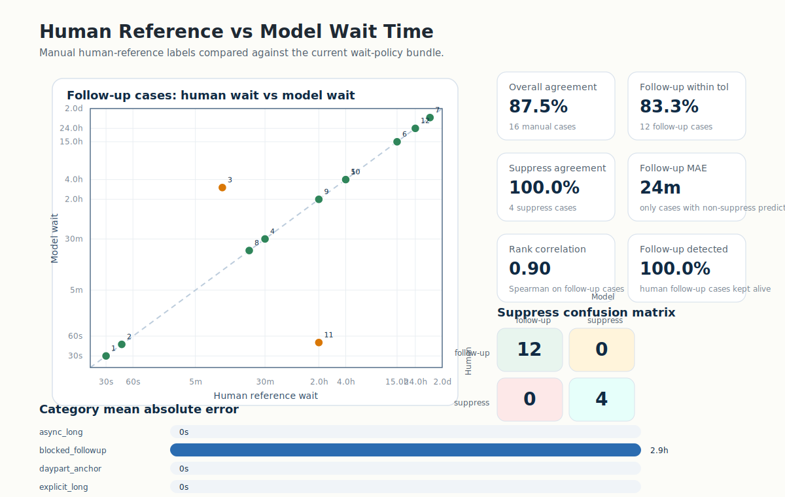
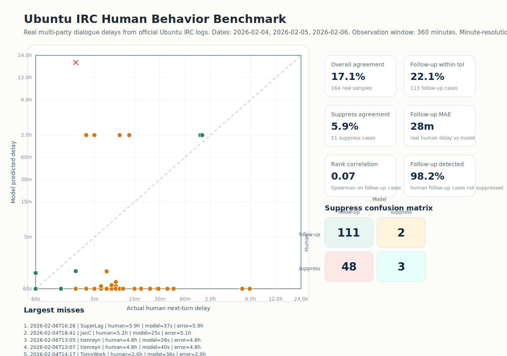

# Active Terminal Assistant

Active Terminal Assistant is a local Ollama chat CLI with a learned wait-policy model for proactive follow-up timing.

The core question is:

After the assistant has already spoken, and if the user stays silent from now on, when should the assistant speak again?

This repository keeps that timing policy local, lightweight, and deployable. The delay predictor is not an LLM.

## Repository Contents

- `ollama_wait_cli.py`: minimal multi-turn Ollama CLI using `gemma4:e4b`
- `wait_model.py`: lightweight wait-policy model, features, guardrails, and bundle loading
- `run_training.py`: synthetic-data training and benchmark pipeline
- `human_reference_benchmark.py`: manual human-reference benchmark and chart generation
- `human_reference_cases.json`: dialogue-history cases with human-reference wait labels
- `main.ipynb`: notebook entry point for training and export
- `smoke_test_ollama_wait_cli.py`: end-to-end CLI smoke test
- `artifacts/`: trained weights, benchmark metrics, reports, and generated charts

## Current Stack

- Runtime: Ollama
- Chat model: `gemma4:e4b`
- Wait-policy model: `artifacts/wait_policy_bundle.pt`
- Thinking mode: disabled by default through Ollama `think: false`
- Device selection: the wait-policy model uses CUDA automatically when available

## Project Layout

```text
.
|- artifacts/
|  |- benchmark_report.md
|  |- context_showcase.md
|  |- human_reference_benchmark.json
|  |- human_reference_benchmark.md
|  |- human_reference_comparison.svg
|  |- metrics.json
|  |- prediction_preview.json
|  |- wait_policy_bundle.pt
|  `- wait_policy_state.pt
|- human_reference_benchmark.py
|- human_reference_cases.json
|- main.ipynb
|- ollama_wait_cli.py
|- requirements.txt
|- run_training.py
|- smoke_test_ollama_wait_cli.py
`- wait_model.py
```

## Install

Create and activate a virtual environment if needed:

```powershell
python -m venv .ashley
.\.ashley\Scripts\Activate.ps1
```

Install dependencies:

```powershell
python -m pip install -r requirements.txt
```

For NVIDIA GPU on Windows, install the matching CUDA build of PyTorch. Example for CUDA 12.8:

```powershell
python -m pip install --upgrade --force-reinstall torch==2.11.0+cu128 --index-url https://download.pytorch.org/whl/cu128
```

## Run The CLI

Start the local chat CLI:

```powershell
python ollama_wait_cli.py
```

The CLI will:

- spawn a dedicated `ollama serve` process on a local port
- run multi-turn chat with `gemma4:e4b`
- run the wait-policy model after each assistant turn
- print the recommended next proactive delay if the user stays silent
- fully kill the spawned Ollama process on exit

Useful flags:

```powershell
python ollama_wait_cli.py --device cuda
python ollama_wait_cli.py --think
python ollama_wait_cli.py --model gemma4:e4b
```

## Train Or Rebuild The Model

Run the training pipeline:

```powershell
python run_training.py
```

Or execute the notebook:

```text
main.ipynb
```

Training outputs are written into `artifacts/`.

## Human-Reference Benchmark

This repository now includes a manual human-reference benchmark across different dialogue histories.

What it measures:

- explicit second-level reminders
- urgent incident follow-ups
- blocked clarification cases
- medium and long async follow-ups
- daypart anchors such as `after lunch` and `tomorrow morning`
- soft busy/space-seeking contexts
- explicit suppress / do-not-contact closes

Important:

- these labels are manually assigned human-reference delays
- this is a single-rater benchmark, not production telemetry
- it is useful for checking practical alignment, especially on edge cases the synthetic benchmark can hide

Run it with:

```powershell
python human_reference_benchmark.py
```

Latest benchmark snapshot:

- total cases: `16`
- follow-up cases: `12`
- suppress cases: `4`
- overall within-tolerance rate: `87.5%`
- follow-up within-tolerance rate: `83.3%`
- suppress agreement rate: `100.0%`
- follow-up detection rate: `100.0%`
- follow-up MAE: `1452s`
- follow-up Spearman rank correlation: `0.90`

The largest observed misses in the current snapshot are:

- blocked clarification after 10 minutes: model predicted about `3.0h`
- soft deep-work request: human reference `2.0h`, model predicted `48s`

### Human vs Model Comparison



Detailed outputs:

- `artifacts/human_reference_benchmark.md`
- `artifacts/human_reference_benchmark.json`
- `artifacts/human_reference_comparison.svg`

## Real Timestamp Benchmark

This repository also includes a real-world behavior benchmark built from the official Ubuntu IRC public logs.

What it measures:

- real human multi-party conversation history
- minute-level public timestamps from the official log archive
- delay until the same speaker naturally speaks again in the same approximate dialogue thread
- suppress cases where that speaker does not speak again within the observation window

Important:

- this is not an optimal-policy benchmark
- it is an external-distribution behavior benchmark
- it is intentionally harder than the manual benchmark because the data is noisy, multi-party, and only weakly mapped into the current two-role model

Run it with:

```powershell
python ubuntu_irc_behavior_benchmark.py
```

Current benchmark configuration:

- source: official Ubuntu IRC logs for `2026-02-04`, `2026-02-05`, `2026-02-06`
- channel: `#ubuntu`
- observation window: `6h`
- role mapping used for the current model: focal speaker -> `assistant`, all other visible participants -> `user`

Latest benchmark snapshot:

- total cases: `164`
- follow-up cases: `113`
- suppress cases: `51`
- overall within-tolerance rate: `17.1%`
- follow-up within-tolerance rate: `22.1%`
- suppress agreement rate: `5.9%`
- follow-up detection rate: `98.2%`
- follow-up MAE: `1673.9s`
- follow-up Spearman rank correlation: `0.066`

Interpretation:

- the current model is strongly over-eager on real IRC data
- it tends to predict another follow-up quickly instead of learning when humans actually stop speaking in that thread
- this benchmark is useful precisely because it exposes the distribution gap hidden by the synthetic training set

### Real Human Behavior Comparison



Detailed outputs:

- `artifacts/ubuntu_irc_behavior_benchmark.md`
- `artifacts/ubuntu_irc_behavior_benchmark.json`
- `artifacts/ubuntu_irc_behavior_comparison.svg`
- `ubuntu_irc_behavior_benchmark.py`

## Existing Model Artifacts

Main generated artifacts:

- `artifacts/metrics.json`
- `artifacts/benchmark_report.md`
- `artifacts/context_showcase.md`
- `artifacts/wait_policy_bundle.pt`
- `artifacts/wait_policy_state.pt`

## Test

Run the CLI smoke test:

```powershell
python smoke_test_ollama_wait_cli.py
```

This verifies:

- Ollama server startup
- one real chat roundtrip
- wait-policy inference
- full server shutdown on exit
- port release after exit

## Notes

- The synthetic benchmark is still useful for iteration speed.
- The new human-reference benchmark exists to expose cases where synthetic generation can overstate quality.
- Model artifacts are committed so the CLI can run without retraining first.
